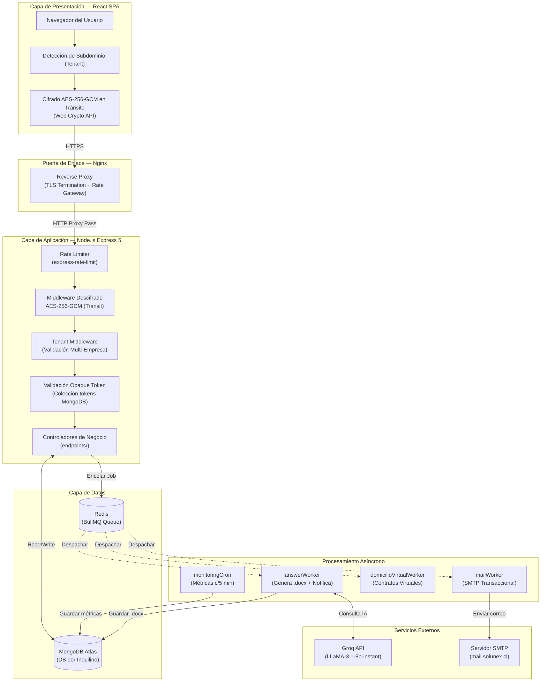

# 01 · Arquitectura General — Solunex Portal RRHH

> **Sistema de Automatización Documental y Gestión de Procesos para Recursos Humanos**  
> Stack: JavaScript Full-Stack (React · Node.js · MongoDB · Redis)  
> Versión: `2.1.0`

---

## 1. Visión Global del Sistema

Solunex Portal RRHH implementa una **arquitectura distribuida basada en el modelo Cliente-Servidor avanzado**, diseñada para garantizar escalabilidad bajo demanda, seguridad perimetral y alta disponibilidad. El backend opera como un servicio **sin estado (stateless)**, lo que habilita el escalamiento horizontal fluido frente a picos de concurrencia.

```
[Usuario / Navegador]
        │
        │ HTTPS (TLS/SSL)
        ▼
[Nginx — Reverse Proxy / Gateway]
        │
        │ HTTP Interno (Proxy Pass)
        ▼
[API REST — Node.js + Express 5]
        │
   ┌────┴─────────────────────────┐
   │                              │
   ▼                              ▼
[MongoDB Atlas]             [Redis — BullMQ]
   │                              │
   │               ┌──────────────┘
   │               │
   │          [Workers Asíncronos]
   │               │
   └───────────────┘
        (Escritura final de documentos)

        [Groq API] ◄──── API externa de IA
        [SMTP Server] ◄─ Correo transaccional
```

---

## 2. Diagrama de Flujo Detallado por Capas



---

## 3. Arquitectura Multi-Tenant (Multi-Inquilino)

El sistema implementa una estrategia de **aislamiento físico de base de datos por inquilino** (Database-per-Tenant). Cada empresa cliente posee su propia base de datos aislada dentro del mismo clúster MongoDB Atlas.

### Flujo de Resolución de Tenant

1. **Detección en Frontend**: El cliente extrae el subdominio de la URL. `empresa1.solunex.cl` → tenant `empresa1`. En local sin subdominio, usa `"api"` por defecto.
2. **Validación en Backend**:
   - Captura el parámetro `:company` de la ruta REST.
   - Si es un tenant de sistema (`api`, `infoacciona`, `solunex`) → acceso directo.
   - Si no, consulta la colección global `config_empresas` en `formsdb` para verificar el registro.
   - Si es inválido → `HTTP 404: Tenant o empresa no válida`.
3. **Caché de Conexiones**: Una vez validado, la instancia de base de datos se almacena en un mapa local en memoria (`dbCache`) para evitar latencia de reconexión en peticiones subsiguientes.
4. **Inyección en Request**: La conexión se inyecta en `req.db` para que todos los controladores la consuman de forma transparente.

```
formsdb (Global)
  └── config_empresas        ← Registro de todos los Tenants
  
empresa1 (Tenant A)
  ├── usuarios
  ├── respuestas
  ├── docxs
  └── ...

empresa2 (Tenant B)
  ├── usuarios
  ├── respuestas
  ├── docxs
  └── ...
```

---

## 4. Stack Tecnológico Completo

### Frontend

| Tecnología | Versión | Propósito |
|:-----------|:--------|:----------|
| **React** | 18.2 | Framework UI — SPA con arquitectura de componentes |
| **Vite** | 7.x | Build tool y Dev Server ultrarrápido con HMR |
| **Redux Toolkit** | 2.x | Gestión de estado global (sesión, permisos, flujos) |
| **React Router** | 7.x | Enrutamiento del cliente con lazy loading y protección de rutas |
| **Tailwind CSS** | 3.4 | Sistema de diseño responsivo y adaptativo |
| **Framer Motion** | 12.x | Micro-animaciones y transiciones de interfaz |
| **TipTap** | 3.x | Editor de texto enriquecido (Rich Text) para plantillas |
| **@dnd-kit** | 6.x | Drag & Drop nativo para ordenación de elementos |
| **Recharts** | 3.x | Gráficos interactivos para métricas y dashboards |
| **D3.js** | 7.x | Visualización de datos avanzada |
| **Web Crypto API** | Native | Cifrado AES-256-GCM en el navegador (End-to-End) |

### Backend

| Tecnología | Versión | Propósito |
|:-----------|:--------|:----------|
| **Node.js** | LTS | Entorno de ejecución asíncrono centrado en I/O |
| **Express** | 5.2 | Framework de servidor web con manejo nativo de async/await |
| **MongoDB Driver** | 6.x | Conexiones nativas y operaciones de alta eficiencia |
| **BullMQ** | 5.x | Cola de trabajos robusta y tolerante a fallos sobre Redis |
| **Redis** | — | Broker de mensajería en memoria para las colas |
| **Nodemailer** | 9.x | Envío de correos transaccionales SMTP |
| **Multer** | 2.x | Parseo de archivos Multipart/form-data |
| **@node-rs/argon2** | 2.x | Binding nativo en Rust para hashing Argon2id |
| **docx** | 9.x | Generación programática de archivos Word (.docx) |
| **ExcelJS** | 4.x | Generación y lectura de archivos Excel (.xlsx) |
| **node-cron** | 4.x | Tareas programadas recurrentes (Cron Jobs) |
| **Groq SDK** | 0.37 | Cliente oficial de inferencia IA de baja latencia |
| **Swagger UI Express** | 5.x | Documentación OpenAPI interactiva en `/api-docs` |
| **Helmet** | 8.x | Seguridad HTTP (cabeceras de seguridad estándar) |
| **express-rate-limit** | 8.x | Rate Limiting anti-denegación de servicio |

### Infraestructura y Proxy

| Componente | Tecnología | Función |
|:-----------|:-----------|:--------|
| **Reverse Proxy** | Nginx | Terminación SSL/TLS, Proxy Pass a la API, capa de seguridad perimetral |
| **Base de Datos** | MongoDB Atlas | Persistencia NoSQL multi-tenant con índices compuestos |
| **Message Broker** | Redis | Queue broker para BullMQ y caché en memoria |
| **IA Externa** | Groq API | Inferencia LLM de baja latencia (LPU Hardware) |
| **Correo** | SMTP Propio | Notificaciones transaccionales y códigos 2FA |

---

## 5. Workers Asíncronos (BullMQ + Redis)

Para evitar que el hilo principal de Node.js se bloquee durante tareas pesadas de CPU o I/O, todas las operaciones de alta demanda se delegan mediante colas a procesos secundarios aislados.

### `answerWorker` — Cola `tareas-respuestas`
Procesador del flujo core de generación de documentos:
1. Llama al generador de documentos (`generador.helper.js`) que fusiona las respuestas del formulario con la plantilla Tiptap y produce un archivo `.docx`.
2. Consulta la API de Groq para revisión ortográfica y marcado de inconsistencias en el documento generado.
3. Envía correo de respaldo al colaborador con un resumen visual de sus respuestas.
4. Genera notificaciones push para los roles de RRHH y Administrador.
5. Registra el evento de auditoría en la colección de logs.
- **Concurrencia:** 5 procesos paralelos.
- **Tipo:** CPU Bound (Argon2id) + I/O Bound (Disco, Red, IA).

### `mailWorker` — Cola `tareas-correo`
Distribuidor de correos SMTP salientes con reintentos automáticos:
- Envía plantillas HTML responsivas para activación de cuentas, códigos 2FA y confirmaciones.
- Gestiona reintentos automáticos configurados en Redis ante fallos del servidor SMTP.

### `domicilioVirtualWorker` — Cola `tareas-domicilio`
Ciclo de vida contractual de servicios de Domicilio Virtual:
- Genera contratos de domicilio en formato `.docx`.
- Calcula cuotas, límites de usuarios y almacenamiento.
- Crea y sincroniza tickets de seguimiento interno.

### `scheduledActionWorker` — Cola `tareas-programadas`
Motor de programación de acciones futuras:
- Ejecuta acciones diferidas en tiempo (correos programados, mensajes internos, cargas de documentos).
- Utilizado por el módulo de Anuncios Programados.

### `anuncioSchedulerWorker` — Cron Local
Inicializa los schedulers de anuncios programados para todos los tenants registrados al arrancar el servidor.

### `monitoringCron` — Cron Local (Node-cron)
Ejecuta cada 5 minutos:
- Mide uso de CPU de Node.js, RAM del host y latencia de base de datos.
- Almacena en `system_metrics` con retención rotatoria de 7 días.
- Evalúa umbrales de alerta configurados dinámicamente y notifica al equipo TI si se superan.
- Implementa *cooldown* de 1 hora para evitar saturación de alertas.

---

## 6. Pipeline del Generador de Documentos Legales

```
[Formulario Reactivo (React/Tiptap)] 
        │
        │ POST /answers (JSON Cifrado AES)
        ▼
[API Express — Persist & Queue]
  1. Validar token y límites de plan
  2. Cifrar respuestas (AES-256-GCM) y extraer Search Tokens
  3. Insertar en MongoDB (estado: "pendiente")
  4. Encolar job en BullMQ/Redis
  5. Responder al cliente inmediatamente (200 OK)
        │
        │ (Async, Worker en segundo plano)
        ▼
[answerWorker — Proceso Aislado]
  1. Recuperar respuestas y plantilla del formulario
  2. Evaluar condicionales [[IF: CONDICION]]...[[ENDIF]]
  3. Sustituir variables {{NOMBRE_VARIABLE}}
  4. Aplicar filtros de fecha, numerales ordinales y casing
  5. Llamar a Groq API → Revisión ortográfica y marcado IA
  6. Generar archivo .docx (librería docx)
  7. Actualizar estado en MongoDB → "completado"
  8. Notificar a roles RRHH y Administrador
```

El motor de plantillas soporta:
- Variables simples: `{{NOMBRE_TRABAJADOR}}`
- Control de casing automático (MAYÚSCULAS, minúsculas, mixto)
- Formateo de fechas en español: `2026-05-26` → `26 de mayo de 2026`
- Numerales ordinales secuenciales: `{{NUMERAL}}` → `PRIMERO`, `SEGUNDO`...
- Condicionales lógicos: `[[IF: PLAN = ANUAL]]` con operadores `=`, `!=`, `><`, `<`, `>`
- Encadenamiento lógico `&&` y `||`

---

## 7. Módulo de Inteligencia Artificial (Groq)

### Asesor Legal Virtual (Chatbot)
- Responde consultas sobre el Código del Trabajo chileno, SII y trámites comerciales.
- Historial de conversación cifrado en MongoDB (AES-256-GCM).
- Restricción absoluta de redactar contratos o escrituras públicas.
- Modelo: `llama-3.1-8b-instant` (inferencia de baja latencia mediante LPU).

### Revisión Automática de Documentos
- Una vez generado el `.docx`, el texto se envía a Groq con un prompt especializado (`REVISOR_SYSTEM_PROMPT`).
- El modelo audita ortografía y gramática sin alterar el sentido legal.
- Marca secciones que requieren revisión humana obligatoria antes de la emisión final.

---

## 8. Módulo de Monitoreo de Rendimiento

El módulo `/monitoring` expone telemetría en tiempo real del servidor:
- **`GET /ping`**: Medición de latencia pura Red → Backend.
- **`GET /metrics/current`**: CPU de Node, RAM del host y latencia de la base de datos en tiempo real.
- **`GET /metrics/historical`**: Serie temporal de métricas recopiladas cada 5 minutos (7 días de retención).
- **`GET|POST /config`**: Configuración dinámica de umbrales de alerta con notificación por plataforma y/o correo.

---

*[← Índice](00_README.md) · [Siguiente: Modelo de Datos →](02_modelo_datos_nosql.md)*
