# 02 · Modelo de Datos NoSQL — Solunex Portal RRHH

> **Base de Datos:** MongoDB Atlas  
> **Patrón:** Database-per-Tenant (Aislamiento Físico) + Esquemas Polimórficos  
> **Driver:** MongoDB Node.js Driver v6 (sin Mongoose — acceso nativo directo)

---

## 1. Estrategia Multi-Tenant: Aislamiento Físico

A diferencia del enfoque relacional clásico que utiliza columnas discriminadoras, Solunex implementa un modelo de **base de datos física separada por empresa**. Esto garantiza aislamiento total, rendimiento óptimo para consultas y cumplimiento de privacidad de datos empresariales.

```
Clúster MongoDB Atlas
│
├── formsdb                    ← Base de Datos Global (Sistema)
│   └── config_empresas        ← Registro de todos los tenants
│
├── empresa_a                  ← Tenant: Empresa A
│   ├── usuarios
│   ├── respuestas             ← Colección polimórfica principal
│   ├── docxs
│   ├── adjuntos
│   ├── firmados
│   ├── aprobados
│   ├── tokens
│   ├── 2fa_codes
│   ├── ingresos
│   ├── forms
│   ├── plantillas
│   ├── anuncios
│   ├── trabajadores
│   ├── chatbot
│   ├── soporte
│   ├── pagos
│   ├── system_metrics
│   └── ...
│
└── empresa_b                  ← Tenant: Empresa B (aislada)
    └── (mismas colecciones)
```

---

## 2. Diagrama de Colecciones (Modelo Conceptual)

```mermaid
classDiagram
    direction TB

    class `formsdb (Global)` {
        <<Base de Datos Central>>
        Gestiona todos los Tenants
    }
    class config_empresas {
        +ObjectId _id
        +String dbName
        +String nombre_empresa
        +Date fecha_registro
    }
    `formsdb (Global)` *-- config_empresas : "contiene"

    class `Tenant DB (Por Empresa)` {
        <<Bases de Datos Aisladas>>
        Una por cada empresa cliente
    }

    class usuarios {
        +ObjectId _id
        +String mail [Cifrado]
        +String mail_index [Blind Index SHA-256]
        +String nombre [Cifrado]
        +String password_hash [Argon2id]
        +String rol [Texto Plano: RBAC]
        +String estado [activo / pendiente / inactivo]
        +Boolean twoFactorEnabled
    }

    class tokens {
        +ObjectId _id
        +String token [Opaque — 32 bytes hex]
        +String email [Cifrado]
        +String email_index [Blind Index]
        +String userId
        +String rol [Cifrado]
        +Date expiresAt
        +String active [Cifrado]
    }

    class twofa_codes["2fa_codes"] {
        +ObjectId _id
        +String userId
        +String code [Hash Argon2id del OTP]
        +String type [2FA_LOGIN / 2FA_SETUP]
        +Date expiresAt
        +Boolean active
        +String code_index [Blind Index]
    }

    class respuestas {
        <<Colección Polimórfica>>
        +ObjectId _id
        +String formId [Referencia lógica]
        +Object user [Datos cifrados AES]
        +Object responses [Esquema flexible — Polimórfico]
        +String formTitle
        +String status [pendiente / completado]
        +String[] searchTokens [Tokens de búsqueda]
        +ObjectId trabajadorId [Ref. opcional]
        +Date createdAt
        +Date updatedAt
        +Array cambios [Historial de estados]
    }

    class ContratoPlazoFijo {
        <<Esquema Dinámico>>
        responses.NombreCompleto
        responses.RutTrabajador
        responses.SueldoBase
        responses.FechaInicio
        responses.CargoLaboral
    }
    class AnexoTeletrabajo {
        <<Esquema Dinámico>>
        responses.DireccionRemota
        responses.AsignacionInternet
        responses.JornadaRemota
    }

    class docxs {
        <<Trazabilidad Documental>>
        +ObjectId _id
        +ObjectId responseId [Ref. lógica → respuestas]
        +String IDdoc
        +Binary fileData [Archivo .docx en Buffer]
        +Date createdAt
    }

    class adjuntos {
        <<Archivos del Cliente>>
        +ObjectId _id
        +ObjectId responseId [Ref. lógica → respuestas]
        +String fileName [Cifrado]
        +String fileData [Base64]
        +String mimeType
        +Number size
        +Boolean isIndividual
    }

    class firmados {
        <<Auditoría>>
        +ObjectId _id
        +ObjectId responseId [Ref. lógica → respuestas]
        +Date fecha_firma
        +String firmadoPor
    }

    class ingresos {
        <<Log de Autenticación>>
        +ObjectId _id
        +Object usr [Nombre, email, rol — Cifrados]
        +String email_index [Blind Index]
        +String ipAddress [Cifrado]
        +String os [Cifrado]
        +String browser [Cifrado]
        +Date now
    }

    `Tenant DB (Por Empresa)` *-- usuarios
    `Tenant DB (Por Empresa)` *-- tokens
    `Tenant DB (Por Empresa)` *-- twofa_codes
    `Tenant DB (Por Empresa)` *-- respuestas
    `Tenant DB (Por Empresa)` *-- docxs
    `Tenant DB (Por Empresa)` *-- adjuntos
    `Tenant DB (Por Empresa)` *-- firmados
    `Tenant DB (Por Empresa)` *-- ingresos

    respuestas <|-- ContratoPlazoFijo : "Herencia de Esquema"
    respuestas <|-- AnexoTeletrabajo : "Herencia de Esquema"

    respuestas "1" o-- "0..n" docxs : "Ref. Virtual (responseId)"
    respuestas "1" o-- "0..n" adjuntos : "Ref. Virtual (responseId)"
    respuestas "1" o-- "0..1" firmados : "Ref. Virtual (responseId)"
```



---

## 3. Descripción Detallada de Colecciones Principales

### `usuarios` — Gestión de Identidades (RBAC)
Almacena perfiles de usuario con todos los datos sensibles cifrados en reposo.

| Campo | Tipo | Descripción | Seguridad |
|:------|:-----|:------------|:----------|
| `_id` | ObjectId | Identificador único MongoDB | Plano |
| `mail` | String | Correo electrónico | **Cifrado AES-256-GCM** |
| `mail_index` | String | Hash determinista del correo | **SHA-256 Blind Index** |
| `nombre` | String | Nombre del usuario | **Cifrado AES-256-GCM** |
| `apellido` | String | Apellido | **Cifrado AES-256-GCM** |
| `password_hash` | String | Hash de contraseña | **Argon2id (irreversible)** |
| `rol` | String | Rol RBAC | Texto plano (requerido para filtros de acceso) |
| `cargo` | String | Cargo laboral | **Cifrado AES-256-GCM** |
| `estado` | String | `activo`, `pendiente`, `inactivo` | Texto plano |
| `twoFactorEnabled` | Boolean | Estado del 2FA | Texto plano |
| `empresa` | String | Empresa asociada | **Cifrado AES-256-GCM** |

**Índices:** `mail_index` (único, para búsqueda de login sin descifrar)

---

### `respuestas` — Colección Polimórfica (Núcleo Transaccional)
Colección central del sistema. Su diseño polimórfico es la decisión arquitectónica más importante: **una sola colección almacena todos los tipos de formularios** (contratos fijos, indefinidos, teletrabajo, finiquitos, etc.) sin forzar tablas separadas ni Joins.

El campo `responses` contiene un objeto JSON de **estructura variable** según el tipo de formulario (`formId`). El campo `tipo_formulario` actúa como **discriminador** para identificar el esquema en tiempo de ejecución.

| Campo | Tipo | Descripción |
|:------|:-----|:------------|
| `_id` | ObjectId | Identificador único |
| `formId` | String | Referencia al formulario origen |
| `formTitle` | String | Nombre del trámite |
| `user` | Object | Datos del solicitante (cifrados) |
| `responses` | Object | **Respuestas dinámicas** (polimórficas, cifradas) |
| `status` | String | `pendiente` → `completado` → `archivado` |
| `searchTokens` | String[] | Tokens de búsqueda generados pre-cifrado |
| `cambios` | Array | Historial cronológico de cambios de estado |
| `trabajadorId` | ObjectId | Referencia opcional a perfil de trabajador |

**Índices compuestos:**
- `{ updatedAt: -1 }` — Ordenamiento cronológico
- `{ searchTokens: 1, updatedAt: -1 }` — Búsqueda full-text eficiente
- `{ trabajadorId: 1 }` — Filtro por trabajador

---

### `tokens` — Sesiones Activas (Opaque Token Pattern)
A diferencia de los JWT estándar, Solunex implementa **Opaque Tokens**: cadenas aleatorias de 32 bytes (hex) almacenadas en base de datos con expiración controlada. Esto permite revocar sesiones activas de forma inmediata, algo imposible con JWT.

| Campo | Descripción |
|:------|:------------|
| `token` | Cadena aleatoria de 64 caracteres hex (`crypto.randomBytes(32)`) |
| `expiresAt` | Expiración de 4 horas desde emisión |
| `active` | Estado del token (cifrado, para prevenir manipulación) |
| `email_index` | Blind index para búsqueda sin descifrar |

---

### `2fa_codes` — Autenticación de Doble Factor
Almacena códigos OTP de 6 dígitos **hasheados con Argon2id** (nunca en texto plano). Expiración de 5 minutos para login y 15 minutos para activación.

---

### `docxs` — Trazabilidad de Documentos Generados
Contiene los metadatos y el binario del archivo `.docx` generado por el Worker. La referencia a `respuestas._id` mediante `responseId` es una **referencia lógica** (sin foreign key formal, propio del paradigma NoSQL).

---

### `adjuntos` — Archivos Subidos por Clientes
Cada archivo se almacena como un documento independiente (`isIndividual: true`) para evitar exceder el límite de 16MB por documento BSON de MongoDB. Los binarios se almacenan en formato Base64 con el nombre de archivo cifrado.

---

### `ingresos` — Auditoría de Accesos
Registro inmutable de cada inicio de sesión exitoso. Contiene dirección IP, sistema operativo y navegador, todos cifrados en reposo. Los Blind Indexes `email_index` y `name_index` permiten búsquedas analíticas sin necesidad de descifrar el historial completo.

---

## 4. Política de Cifrado en los Documentos MongoDB

Todos los campos sensibles se almacenan en el formato:

```
iv (24 hex) : authTag (32 hex) : ciphertext (hex)
```

Ejemplo de cómo luce un campo cifrado en la base de datos:
```
"nombre": "3a5f1e2b8c9d0f4a:7b3e9a1c2d5f8e0b:a4f2e1d9c3b8a5f2..."
```

Los campos **nunca cifrados** (Plaintext) son: `_id`, `formId`, `status`, `rol`, `createdAt`, `updatedAt` y todos los índices ciegos (`*_index`). Esto es necesario para que el motor de MongoDB pueda realizar filtros y ordenamientos sin descifrado.

---

## 5. Justificación del Diseño NoSQL vs. Relacional

| Criterio | Diseño Relacional | Diseño NoSQL Polimórfico (Solunex) |
|:---------|:-----------------|:------------------------------------|
| **Tipos de contratos** | Tabla por tipo (Tabla_ContratoFijo, Tabla_Teletrabajo...) | Una colección `respuestas` con esquema dinámico |
| **Nuevos campos** | Requiere `ALTER TABLE` (migración) | Se agrega el campo al documento (sin downtime) |
| **Consultas** | JOIN entre múltiples tablas | Documentos auto-contenidos (sin Joins) |
| **Rendimiento** | Degradado por Joins en tablas grandes | Lectura O(1) por índice directo |
| **Flexibilidad** | Rígido (esquema fijo) | Alta (esquema polimórfico por discriminador) |
| **Escalabilidad** | Vertical (más CPU/RAM) | Horizontal (sharding nativo) |

---

*[← Arquitectura](01_arquitectura_general.md) · [Siguiente: Seguridad →](03_seguridad_criptografia.md)*
