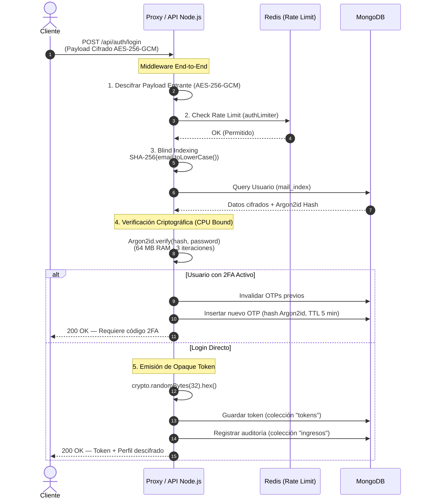

# 03 · Seguridad y Criptografía — Solunex Portal RRHH

> **Estándar de Cifrado:** AES-256-GCM (NIST FIPS 197)  
> **Hashing:** Argon2id (Password Hashing Competition winner)  
> **Blind Indexing:** SHA-256 determinista  
> **Tokens de Sesión:** Opaque Token Pattern (32 bytes criptográficamente seguros)

---

## Resumen del Modelo de Seguridad

Solunex implementa una arquitectura de defensa en profundidad con múltiples capas de protección que operan de forma complementaria:

```
Capa 1: Red         → HTTPS/TLS (Nginx) + Rate Limiting (express-rate-limit + Redis)
Capa 2: Tránsito    → Cifrado E2E AES-256-GCM (Web Crypto API ↔ Node Crypto)
Capa 3: Aplicación  → RBAC + Opaque Token + 2FA + Helmet (Security Headers)
Capa 4: Base Datos  → Cifrado en Reposo AES-256-GCM (Cell-Level Encryption)
Capa 5: Identidad   → Argon2id (Password Hashing) + SHA-256 (Blind Indexing)
Capa 6: Auditoría   → Log de accesos cifrado (IP, OS, Browser, Timestamp)
```

---

## 1. Cifrado en Tránsito: End-to-End Payload Encryption

Para neutralizar ataques de interceptación (Man-in-the-Middle) e inyecciones maliciosas de peticiones, todas las solicitudes POST/PUT/PATCH que contienen datos JSON son cifradas en el navegador antes de enviarse.

### Flujo Completo

```
[Cliente]                                           [Backend]
   │                                                    │
   │ 1. Serializa JSON → texto plano                   │
   │ 2. Genera IV aleatorio (12 bytes)                 │
   │    window.crypto.getRandomValues()                │
   │ 3. Deriva llave AES-256 desde TRANSIT_SECRET      │
   │    SHA-256(TRANSIT_SECRET) → 32 bytes             │
   │ 4. Cifra con AES-256-GCM:                         │
   │    { ciphertext + authTag(16 bytes) }             │
   │ 5. Codifica en Base64                             │
   │                                                    │
   │ ──── HTTPS ──────────────────────────────────►    │
   │  { encrypted: true, iv: "...", payload: "..." }   │
   │                                                    │
   │                   6. Middleware detecta encrypted  │
   │                   7. Reconstruye Buffers           │
   │                   8. SHA-256(TRANSIT_SECRET)       │
   │                   9. Separa ciphertext / authTag   │
   │                   10. AES-256-GCM decrypt          │
   │                   11. Valida AuthTag de integridad │
   │                       Si falla → HTTP 400          │
   │                   12. req.body = JSON plano        │
```

### Estructura del Payload Cifrado

```json
{
  "iv": "e1Fk9mK2pLsRvTyN",
  "payload": "fD92kJm8...base64_ciphertext+authTag...",
  "encrypted": true
}
```

> **Excepción:** Las cargas de archivos binarios (`multipart/form-data`) viajan directamente sin este envoltorio, ya que el esquema de cifrado JSON no aplica a streams binarios. Estos sí viajan sobre HTTPS del canal TLS de Nginx.

---

## 2. Cifrado en Reposo: Cell-Level Encryption (AES-256-GCM)

Los datos que llegan al backend **no se almacenan en texto plano en MongoDB**. Se aplica cifrado simétrico campo por campo sobre toda información personalmente identificable (PII).

### Algoritmo y Formato de Almacenamiento

| Elemento | Detalle |
|:---------|:--------|
| **Algoritmo** | AES-256-GCM (Galois/Counter Mode) |
| **Llave** | `MASTER_KEY` de 32 bytes (64 caracteres hexadecimales) desde variable de entorno |
| **IV** | 12 bytes aleatorios únicos por cada cifrado |
| **Auth Tag** | 16 bytes de firma de integridad (AEAD) |

Cada campo cifrado se guarda en MongoDB como un string con el siguiente formato:

```
<iv_24hex>:<authTag_32hex>:<ciphertext_hex>
```

Ejemplo real de un campo `nombre` en la base de datos:
```
"nombre": "3a5f1e2b8c9d0f4a:7b3e9a1c2d5f8e0b:a4f2e1d9c3b8..."
```

### Operaciones de Cifrado/Descifrado

El archivo `seguridad.helper.js` expone helpers recursivos de alto nivel:

- **`cifrarObjeto(obj)`**: Recorre el objeto y cifra todos los campos string. Omite automáticamente: `_id`, `id`, `uid`, `*_index`, `estado`, `rol` (campos requeridos en texto plano para filtros de base de datos).
- **`descifrarObjeto(obj)`**: Proceso inverso. Detecta el patrón de cifrado `^[a-f0-9]{24}:[a-f0-9]{32}:[a-f0-9]+$` y descifra automáticamente. Respeta instancias `ObjectId` y `Date`.
- **`cifrarObjeto` es idempotente**: Si un campo ya está cifrado (detectado por regex), no lo vuelve a cifrar.

### Campos Cifrados vs Campos en Texto Plano

| Cifrado (AES-256-GCM) | Texto Plano (Requerido para consultas) |
|:----------------------|:--------------------------------------|
| `mail`, `nombre`, `apellido` | `mail_index`, `name_index` (Blind Index) |
| `cargo`, `empresa`, `rut` | `_id`, `status`, `rol` |
| `ipAddress`, `browser`, `os` | `formId`, `createdAt`, `updatedAt` |
| `responses.*` (datos del formulario) | `searchTokens` (pre-generados antes de cifrar) |

---

## 3. Búsqueda en Datos Cifrados: Blind Indexing

El cifrado AES con IV aleatorio genera un texto cifrado **diferente cada vez** para el mismo valor. Esto hace imposible realizar búsquedas directas en la base de datos. La solución es el **Índice Ciego (Blind Index)**:

```
[Texto claro]                [Blind Index en DB]
"juan@empresa.com"  ──→  SHA-256("juan@empresa.com")  ──→  "a7f4e2..."
"juan@empresa.com"  ──→  SHA-256("juan@empresa.com")  ──→  "a7f4e2..."  ← mismo siempre
"JUAN@empresa.com"  ──→  SHA-256(normalize) ──────────→  "a7f4e2..."  ← normalizado
```

### Implementación

```javascript
const createBlindIndex = (text) => {
    if (!text) return null;
    return crypto.createHash('sha256')
        .update(text.toLowerCase().trim())
        .digest('hex');
};
```

### Uso en Consultas MongoDB

```javascript
// Buscar usuario por email sin descifrar ningún registro:
const user = await db.collection("usuarios").findOne({
    mail_index: createBlindIndex("juan@empresa.com")
});
```

Los índices ciegos usados en el sistema:
- `mail_index` → Colecciones `usuarios`, `tokens`, `ingresos`
- `name_index` → Colecciones `ingresos`
- `uid_index` → Colección `respuestas`
- `empresa_index` → Colección `respuestas`
- `rut_index` → Colección `domicilio_virtual`
- `code_index` → Colección `2fa_codes`

---

## 4. Hashing de Contraseñas — Argon2id

Las contraseñas no se cifran (operación reversible): se **hashean de forma irreversible** con el algoritmo ganador de la Password Hashing Competition (PHC).

### ¿Por qué Argon2id?

| Algoritmo | Resistencia GPU | Resistencia ASIC | Resistencia Canal Lateral | Post-Cuántico |
|:----------|:----------------|:-----------------|:--------------------------|:--------------|
| MD5 / SHA-1 | ❌ | ❌ | ❌ | ❌ |
| bcrypt | ✅ | ✅ | ❌ | ❌ |
| Argon2d | ✅ | ✅ | ❌ | ✅ |
| **Argon2id** | ✅ | ✅ | ✅ | ✅ |

### Parámetros de Configuración

| Parámetro | Valor | Significado |
|:----------|:------|:------------|
| `algorithm` | `Argon2id` | Variante híbrida (combina Argon2i + Argon2d) |
| `memoryCost` | `2^16` KiB = **64 MB** | RAM obligatoria por hash — inhabilita ataques en GPU/ASIC |
| `timeCost` | `3` | Pasadas sobre la memoria |
| `parallelism` | `1` | Hilo dedicado |

Un atacante que obtenga la base de datos necesita **64 MB de RAM física por cada intento** de contraseña. Con hardware gamer (16 GB de RAM), solo puede probar ~256 contraseñas en paralelo — un rate extremadamente bajo para fuerza bruta.

**Librería:** `@node-rs/argon2` — Binding nativo en Rust sobre Node.js para máximo rendimiento.

---

## 5. Tokens de Sesión — Opaque Token Pattern

A diferencia de los JWT estándar (sin estado, no revocables), Solunex implementa **Opaque Tokens**:

| Característica | JWT Estándar | Opaque Token (Solunex) |
|:--------------|:-------------|:-----------------------|
| Contenido | Payload firmado (decodificable) | Cadena aleatoria opaca |
| Revocación | ❌ Imposible antes de expiración | ✅ Inmediata (marcar como inactive) |
| Almacenamiento | Sin estado (stateless) | Estado en MongoDB (`tokens`) |
| Caducidad | Codificada en el token | Controlada en base de datos |
| Seguridad ante filtración | Token válido hasta expiración | Token inválido inmediatamente |

### Generación
```javascript
const token = crypto.randomBytes(32).toString("hex"); // 64 chars hex
```

### Validación en cada Request
```javascript
// Busca el token en la colección y verifica que esté activo y no expirado
const tokenDoc = await db.collection("tokens").findOne({ token, active: encrypt("true") });
if (!tokenDoc || new Date(tokenDoc.expiresAt) < new Date()) throw "Token inválido";
```

- **Expiración:** 4 horas desde la emisión.
- **Reutilización:** Si el usuario inicia sesión nuevamente antes de expirar, se reutiliza el token activo.
- **Revocación:** Al cerrar sesión, el campo `active` se actualiza a `false` (cifrado).

---

## 6. Autenticación de Doble Factor (2FA) Opcional

```
[Login con contraseña OK]
        │
        ├─ twoFactorEnabled = false → Emitir Opaque Token inmediatamente
        │
        └─ twoFactorEnabled = true
                │
                ├─ 1. Generar OTP: crypto.randomInt(100000, 999999)
                ├─ 2. Hashear OTP con Argon2id (NO guardar en texto plano)
                ├─ 3. Guardar hash en colección 2fa_codes (TTL: 5 min)
                ├─ 4. Enviar código al correo registrado (vía mailWorker)
                └─ 5. Responder al cliente: { twoFA: true }
                
[Frontend muestra input de 6 dígitos]
        │
        └─ POST /auth/verify-login-2fa { email, verificationCode }
                │
                ├─ Buscar código activo no expirado en 2fa_codes (por userId)
                ├─ Argon2id.verify(hash_guardado, codigo_ingresado)
                ├─ Si válido: marcar código como active=false (invalidar)
                └─ Emitir Opaque Token de sesión
```

---

## 7. Rate Limiting Anti-Fuerza Bruta

El endpoint `/auth/login` tiene un limitador más estricto que el global:

| Limitador | Máximo | Ventana | Objetivo |
|:----------|:-------|:--------|:---------|
| `globalLimiter` | Configurable | 15 min | Todos los endpoints |
| `authLimiter` | Configurable | 15 min | Solo `/auth/login` |

Implementado con `express-rate-limit`. El estado del contador de peticiones se almacena **en Redis** para que persista entre reinicios del servidor y funcione correctamente en arquitecturas multi-nodo.

---

## 8. Cabeceras de Seguridad HTTP (Helmet)

El middleware `helmet` configura automáticamente las siguientes cabeceras de seguridad estándar en todas las respuestas:

| Cabecera | Función |
|:---------|:--------|
| `X-Content-Type-Options: nosniff` | Previene MIME-type sniffing |
| `X-Frame-Options: DENY` | Previene clickjacking en iframes |
| `Strict-Transport-Security` | Fuerza HTTPS |
| `Content-Security-Policy` | Controla recursos cargables |
| `X-XSS-Protection` | Activa el filtro XSS del navegador |

---

## 9. Auditoría de Accesos

Cada inicio de sesión exitoso genera un registro inmutable en la colección `ingresos`:

```json
{
  "usr": {
    "name": "<cifrado>",
    "email": "<cifrado>",
    "email_index": "a7f4e2... (SHA-256 — para búsquedas)",
    "name_index": "b3c8d1...",
    "rol": "<cifrado>",
    "cargo": "<cifrado>",
    "userId": "ObjectId"
  },
  "ipAddress": "<cifrado>",
  "os": "<cifrado>",
  "browser": "<cifrado>",
  "now": "ISODate — Zona horaria America/Santiago"
}
```

**Nota importante:** Este registro de IP es exclusivamente para auditoría de seguridad perimetral y **no constituye firma electrónica** de ningún documento del sistema.

---

## 10. Flujo de Seguridad del Login (Diagrama de Secuencia)



---

*[← Modelo de Datos](02_modelo_datos_nosql.md) · [Siguiente: Manual del Desarrollador →](04_manual_desarrollador.md)*
