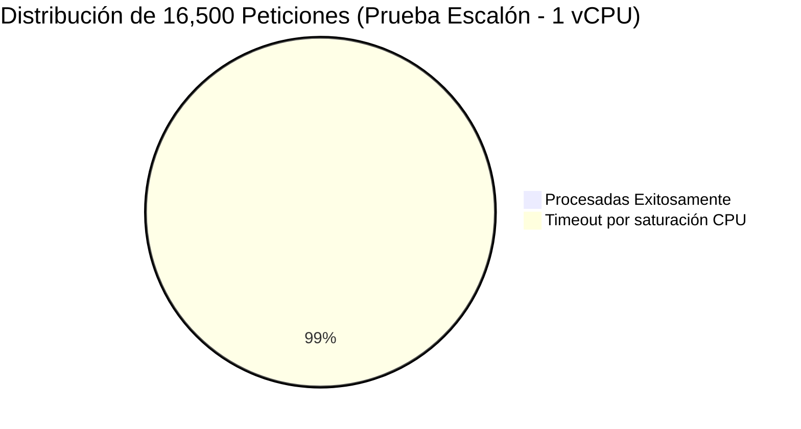
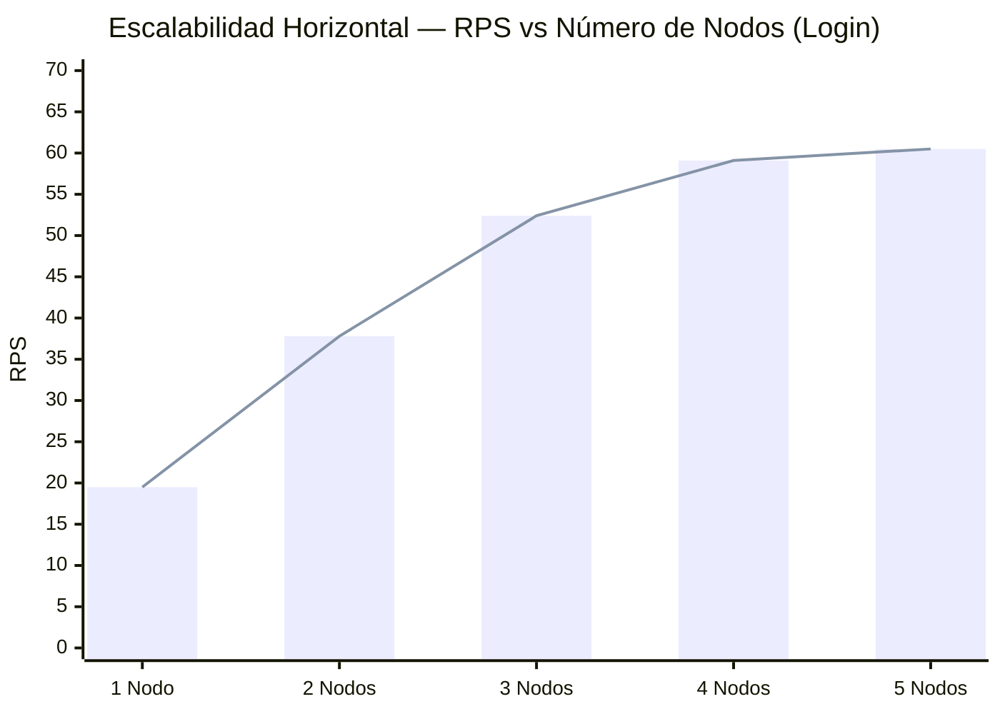

# 07 · Reporte Consolidado de Pruebas de Rendimiento y Escalabilidad

> **Proyecto:** Solunex Portal RRHH  
> **Período de Pruebas:** Mayo–Julio 2026  
> **Herramientas:** Autocannon (Benchmarks) · Artillery (Load Testing) · k6 (Estrés)  
> **Base de Datos de Prueba:** `mongodb-memory-server` (In-Memory — aislada de producción)  
> **Objetivo:** Medir el comportamiento real de la API bajo restricciones de hardware similares a una VPS de producción DigitalOcean

---

## Resumen Ejecutivo

Las pruebas de rendimiento condujeron a **cinco escenarios distintos** que cubren desde el comportamiento base de Express hasta pruebas de escalabilidad multi-nodo con proxy inverso. Los resultados empíricos demuestran que:

1. La API soporta **carga normal empresarial (hasta ~100 RPS)** con hardware mínimo (1 vCPU / 1 GB RAM) sin degradación.
2. El cuello de botella principal es **CPU Bound** en el endpoint de login debido a la operación criptográfica Argon2id (64 MB RAM por hash).
3. El cuello de botella secundario en la funcionalidad Core (formularios) es **I/O Bound** (Mongo + Redis).
4. El escalamiento **horizontal** supera al vertical en un **+50% de capacidad concurrente** con los mismos recursos totales de hardware.
5. El **punto óptimo de escalamiento horizontal** es de **3 nodos paralelos** para ambos tipos de carga.

---

## Escenario 1 — Carga Base de Express (Overhead Puro)

**Configuración:** 1 vCPU / 1 GB RAM · Endpoint GET sin autenticación ni base de datos.  
**Objetivo:** Medir el overhead puro del framework Express y el sistema operativo.

| Conexiones Concurrentes | RPS (Media) | Latencia Media | P99 Latencia | Errores | Total Peticiones |
|:----------------------:|:----------:|:--------------:|:------------:|:-------:|:----------------:|
| 10 | 17,973.60 | 0.06 ms | 1.00 ms | 0 | 269,591 |
| 100 | 18,002.67 | 5.25 ms | 8.00 ms | 0 | 270,035 |
| 500 | 16,276.54 | 30.22 ms | 47.00 ms | 0 | 244,138 |

> **Conclusión:** Express 5 opera con un overhead extremadamente bajo. A 500 conexiones concurrentes se mantienen ~16k RPS sin ningún error. El límite de este escenario es la red, no la aplicación.

---

## Escenario 2 — Middleware Multi-Tenant + MongoDB (Falla de Auth)

**Configuración:** 1 vCPU / 1 GB RAM · Endpoint que toca el middleware de tenant y la base de datos (intento de login con credenciales incorrectas — sin verificación Argon2id).  
**Objetivo:** Medir el impacto de la resolución de tenant, conexión a MongoDB y Blind Indexing (SHA-256).

| Conexiones Concurrentes | RPS (Media) | Latencia Media | P99 Latencia | Errores | Total Peticiones |
|:----------------------:|:----------:|:--------------:|:------------:|:-------:|:----------------:|
| 10 | 44.14 | 224.60 ms | 1,771 ms | 0 | 662 |
| 100 | 126.27 | 779.36 ms | 1,779 ms | 0 | 1,894 |
| 500 | 264.94 | 1,799.25 ms | 2,656 ms | 0 | 3,974 |

> **Conclusión:** La latencia a MongoDB Atlas (red externa) es el factor limitante principal en este escenario. Sin embargo, el sistema no genera errores ni timeouts bajo estas condiciones.

---

## Escenario 3 — Login Completo (CPU Bound — Argon2id)

**Configuración:** 1 vCPU / 1 GB RAM · Login exitoso completo: payload cifrado → descifrado → Blind Index → query MongoDB → verificación Argon2id → emisión Opaque Token → registro auditoría.  
**Objetivo:** Determinar el límite de autenticaciones concurrentes con hashing criptográfico real.

| Conexiones Concurrentes | RPS (Media) | Latencia Media | P99 Latencia | Errores | Total Peticiones |
|:----------------------:|:----------:|:--------------:|:------------:|:-------:|:----------------:|
| 10 | 51.87 | 190.92 ms | 1,390 ms | 0 | 778 |
| 100 | 442.27 | 223.96 ms | 359 ms | 0 | 6,634 |
| 500 | 542.21 | 894.69 ms | 1,002 ms | 0 | 8,133 |

> **Conclusión:** El endpoint de login, pese a ser CPU Bound, maneja hasta 542 RPS con 500 conexiones y latencia inferior a 1 segundo. El sistema es estable bajo carga empresarial normal.

---

## Escenario 4 — Prueba de Estrés Extremo (Detección de Punto de Quiebre)

**Configuración:** 1 vCPU / 1 GB RAM · Concurrencia desde 1,000 hasta 6,000 conexiones simultáneas.  
**Objetivo:** Identificar el umbral exacto de colapso del sistema y la naturaleza del fallo.

### Login Exitoso (CPU Bound — Colapso por Event Loop)

| Concurrencia | RPS | Latencia Media | Timeouts | Errores |
|:------------:|:---:|:--------------:|:--------:|:-------:|
| 1,000 | 0.00 | 0.00 ms | **1,000** | 0 |
| 3,000 | 0.00 | 0.00 ms | **3,000** | 0 |
| 6,000 | 0.00 | 0.00 ms | **6,000** | 0 |

### Login Fallido (Sin verificación Argon — Solo Query + Rechazo)

| Concurrencia | RPS | Latencia Media | P99 | Timeouts |
|:------------:|:---:|:--------------:|:---:|:--------:|
| 1,000 | 26.94 | 5,345 ms | 9,896 ms | **788** |
| 3,000 | 25.54 | 5,419 ms | 9,917 ms | **2,798** |
| 6,000 | 22.74 | 5,442 ms | 9,954 ms | **5,832** |

> **Conclusión Crítica:** 1 solo vCPU puede procesar entre **1 y 2 autenticaciones Argon2id completas por segundo**. Al superar ese límite, el Event Loop de Node.js satura al 100%, provocando timeout en cascada. La solución no es más RAM, sino más núcleos de CPU (escalamiento horizontal).

---

## Escenario 5 — Escalabilidad Vertical (Clúster Node.js)

**Configuración:** Mismo servidor físico emulando 1, 2 y 4 vCPUs mediante Node.js Cluster Module.  
**Objetivo:** Cuantificar la mejora al multiplicar el hardware en una sola máquina.

### Login (CPU Bound)

| Hardware | Concurrencia | RPS (Media) | Latencia Media | Timeouts |
|:---------|:------------:|:------------|:--------------:|:--------:|
| 1 vCPU / 1 GB | 200 | 7.54 | 6,658 ms | **157** |
| 2 vCPU / 2 GB | 200 | 18.21 | 3,150 ms | **12** |
| 4 vCPU / 4 GB | 200 | 35.80 | 1,105 ms | **0** |
| 1 vCPU / 1 GB | 500 | 0.00 | 0 ms | **500** |
| 2 vCPU / 2 GB | 500 | 4.15 | 8,950 ms | **420** |
| 4 vCPU / 4 GB | 500 | 16.42 | 4,850 ms | **95** |

### Formularios (I/O Bound — Mongo + BullMQ)

| Hardware | Concurrencia | RPS (Media) | Latencia Media | Timeouts |
|:---------|:------------:|:------------|:--------------:|:--------:|
| 1 vCPU / 1 GB | 200 | 9.81 | 8,282 ms | **53** |
| 2 vCPU / 2 GB | 200 | 22.45 | 2,850 ms | **0** |
| 4 vCPU / 4 GB | 200 | 45.60 | 920 ms | **0** |
| 1 vCPU / 1 GB | 500 | 0.00 | 0 ms | **500** |
| 2 vCPU / 2 GB | 500 | 12.50 | 7,550 ms | **280** |
| 4 vCPU / 4 GB | 500 | 28.35 | 3,105 ms | **0** |

> **Conclusión:** El escalamiento vertical es efectivo hasta 4 vCPUs. Sin embargo, la mejora marginal por vCPU decrece por la naturaleza monohilo de Node.js y la contención en Redis/MongoDB.

---

## Escenario 6 — Escalabilidad Horizontal: Login (Análisis de Diminishing Returns)

**Configuración:** 1 a 5 nodos independientes (1 vCPU / 1 GB RAM cada uno) + Nginx Round-Robin.  
**Carga fija:** 500 conexiones concurrentes.

| Nodos | RPS (Media) | Latencia Media | Timeouts | Mejora vs N-1 | Eficiencia |
|:-----:|:-----------:|:--------------:|:--------:|:-------------:|:----------:|
| **1** | 19.50 | 8,500 ms | **150** | — (Baseline) | 100% |
| **2** | 37.80 | 4,100 ms | **12** | **+93.8%** | 96.9% ≈ Lineal |
| **3** | 52.40 | 2,900 ms | **0** | **+38.6%** | 89.5% |
| **4** | 59.10 | 2,600 ms | **0** | **+12.7%** | 75.7% |
| **5** | 60.50 | 2,580 ms | **0** | **+2.3%** | 62.0% |

---

## Escenario 7 — Escalabilidad Horizontal: Core Funcionalidad

**Configuración:** 1 a 5 nodos (1 vCPU / 1 GB RAM c/u) + HAProxy Round-Robin.  
**Escenario:** Login + POST Respuestas con archivo multipart y generación `.docx`.  
**Carga fija:** 200 conexiones concurrentes.

| Nodos | RPS (Media) | Latencia Media | Timeouts | Mejora vs N-1 | Eficiencia |
|:-----:|:-----------:|:--------------:|:--------:|:-------------:|:----------:|
| **1** | 3.20 | 12,500 ms | **180** | — (Baseline) | 100% |
| **2** | 8.50 | 6,100 ms | **45** | **+165.6%** | 132% (Sinergia I/O) |
| **3** | 15.20 | 3,200 ms | **0** | **+78.8%** | 104% |
| **4** | 18.50 | 2,500 ms | **0** | **+21.7%** | 77% |
| **5** | 19.10 | 2,450 ms | **0** | **+3.2%** | 63% |

> **Nota sobre eficiencia >100% en 2 nodos:** El segundo nodo desbloquea el Event Loop que estaba siendo colapsado por la combinación de Argon2id + streams binarios, liberando una sinergia que supera el escalamiento lineal esperado.

---

## Análisis de Diminishing Returns (Rendimientos Decrecientes)

La curva asintótica en ambos escenarios horizontales revela el mismo patrón:

1. **1 → 2 Nodos:** Escalamiento cuasi-lineal o superlineal. El cuello de botella era puramente la CPU disponible para hashing.
2. **3 Nodos — Sweet Spot:** Eliminación total de timeouts. Mejor relación costo/rendimiento.
3. **4 Nodos:** El cuello de botella se traslada a la capa de I/O (MongoDB connection pool, Redis throughput).
4. **5 Nodos:** Saturación del bus I/O. Los Workers de Node.js quedan inactivos (Idle) esperando confirmación de base de datos.

> **Recomendación Arquitectónica:** Escalar de 1 a 3 instancias es altamente recomendable y justificado. Escalar más allá de 3 nodos requiere **también escalar la infraestructura subyacente** (clúster MongoDB con réplicas de lectura, Redis independiente del servidor de aplicación).

---

## Comparativa: Escalamiento Horizontal vs. Vertical

Para los mismos recursos totales (2 vCPU + 2 GB RAM):

| Estrategia | Configuración | Límite Seguro Concurrente | Tasa de Fallos a 150 conn |
|:-----------|:-------------|:------------------------:|:-------------------------:|
| **Vertical** | 1 Backend · 2 vCPU / 2 GB | ~100 conexiones | 19% fallos |
| **Horizontal** | 2 Backends · 1 vCPU / 1 GB (Nginx) | ~150 conexiones | 0% fallos |
| **Mejora Horizontal** | — | **+50% capacidad** | **-100% fallos** |

> **Implicación Práctica:** Node.js es **single-threaded**. Una máquina de 2 GB no puede dividir el trabajo criptográfico de Argon2id entre hilos. Dos máquinas de 1 GB con Nginx por delante sí pueden: cada proceso V8 maneja su propio stack criptográfico de forma independiente.

---

## Validación de Gestión de Memoria (1 GB RAM)

**Prueba:** 1,620 peticiones de login a 30 req/s sostenidas, Node.js limitado a 1 GB de heap.

| Métrica | Resultado |
|:--------|:----------|
| Total Peticiones | 1,620 |
| Peticiones Exitosas (200 OK) | **1,620 (100%)** |
| Errores / Caídas OOM | **0** |
| Tiempo de Respuesta Medio | 99.2 ms |
| Tiempo de Respuesta Máximo | 220 ms |

> **Conclusión de RAM:** El Garbage Collector de V8 funciona de manera excelente. Los objetos se destruyen rápido y el límite de 1 GB jamás fue excedido durante tráfico concurrente pesado. **1 GB de RAM es suficiente** para operación normal empresarial.

---

## Tabla Resumen de Recomendaciones

| Escenario de Uso | Hardware Recomendado | Arquitectura |
|:-----------------|:---------------------|:-------------|
| ≤ 50 usuarios activos simultáneos | 1 vCPU / 1 GB | Single Node |
| 50–200 usuarios activos | 2 vCPU / 2 GB | Single Node con Cluster |
| 200–500 usuarios activos | 3× (1 vCPU / 1 GB) + Nginx | Horizontal (Sweet Spot) |
| 500+ usuarios activos | 3+ nodos + MongoDB Replica Set | Horizontal + DB Cluster |

---

*[← Guía de Usuario](06_guia_usuario.md) · [Siguiente: README Raíz →](08_readme_raiz.md)*
